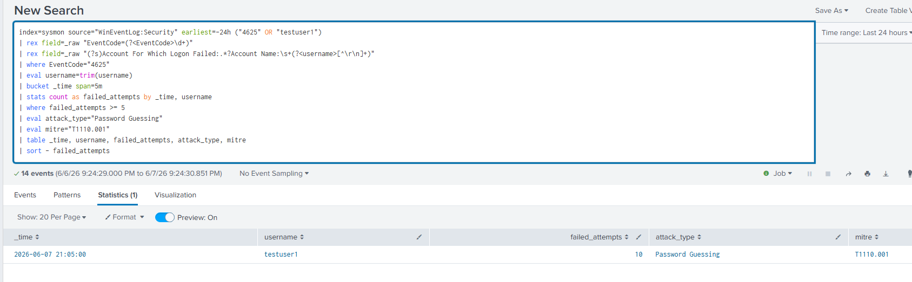
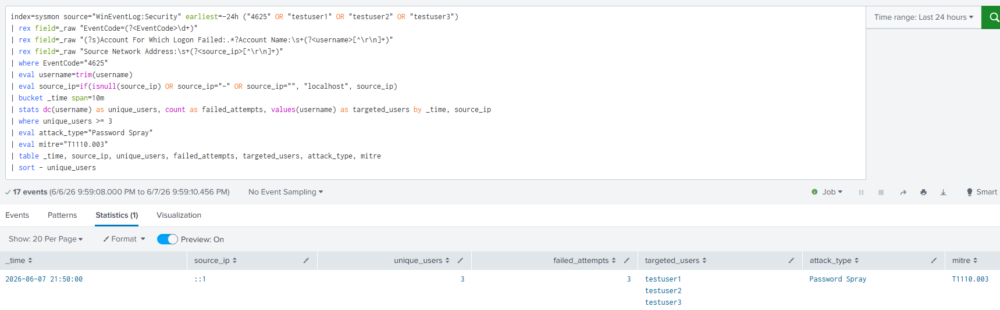
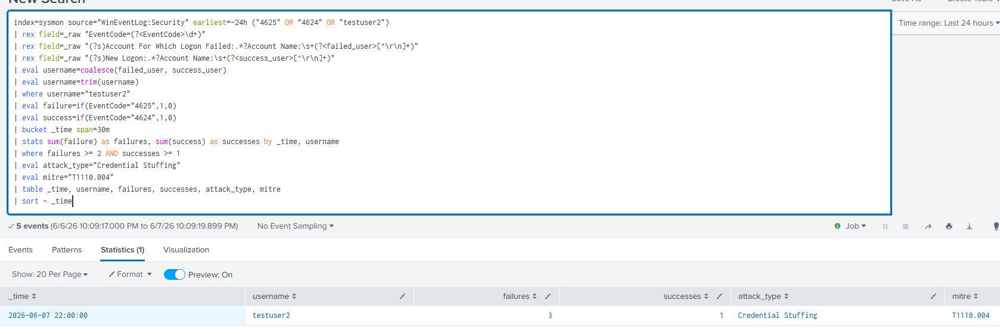
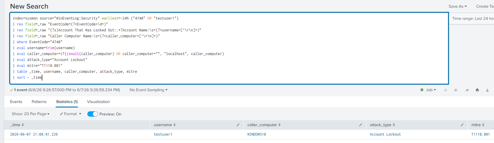

# Brute Force and Credential Attack Detection

## Project Overview

This project simulates and detects three MITRE T1110 credential attack sub techniques using Splunk and Windows Event Logs.

The project focuses on four detections:

Password guessing
Password spraying
Credential stuffing
Account lockout

The detections were built in a Windows SOC home lab using Splunk Enterprise, Windows Security Event Logs, and local Windows test accounts.

## Additional Projects

- [Brute Force and Credential Attack Detection](brute-force-detection/)

## Lab Environment

| Component         | Description                     |
| ----------------- | ------------------------------- |
| SIEM              | Splunk Enterprise               |
| Endpoint          | Windows 10 virtual machine      |
| Log Source        | Windows Security Event Log      |
| Splunk Index      | sysmon                          |
| Test Accounts     | testuser1, testuser2, testuser3 |
| Attack Simulation | Local PowerShell scripts        |

## Attack Types Detected

### Password Guessing

Password guessing occurs when an attacker tries many passwords against one known account. In this lab, testuser1 was targeted with repeated failed logon attempts.

MITRE ATT&CK:

```text
T1110.001 Password Guessing
```

Main event ID:

```text
4625
```

### Password Spraying

Password spraying occurs when an attacker tries one common password against many accounts. In this lab, one password was attempted against testuser1, testuser2, and testuser3.

MITRE ATT&CK:

```text
T1110.003 Password Spraying
```

Main event ID:

```text
4625
```

### Credential Stuffing

Credential stuffing occurs when an attacker uses known or leaked username and password combinations. In this lab, several failed attempts against testuser2 were followed by one successful login.

MITRE ATT&CK:

```text
T1110.004 Credential Stuffing
```

Main event IDs:

```text
4625
4624
```

### Account Lockout

Account lockout occurs when repeated failed login attempts exceed the configured lockout threshold. In this lab, testuser1 was locked after repeated failed attempts.

MITRE ATT&CK:

```text
T1110.001 Password Guessing
```

Main event ID:

```text
4740
```

## Detection Summary

| Alert ID | Attack Type         | MITRE     | Event IDs     | Trigger Condition                         |
| -------- | ------------------- | --------- | ------------- | ----------------------------------------- |
| BF 001   | Password Guessing   | T1110.001 | 4625          | 5 or more failures, same user, 5 minutes  |
| BF 002   | Password Spray      | T1110.003 | 4625          | 3 or more unique users failed, 10 minutes |
| BF 003   | Credential Stuffing | T1110.004 | 4625 and 4624 | Failures followed by success, 30 minutes  |
| BF 004   | Account Lockout     | T1110.001 | 4740          | Any account lockout event                 |

## Simulation Scripts

The attack simulations are stored in:

```text
simulate/
```

| Script       | Purpose                                                                |
| ------------ | ---------------------------------------------------------------------- |
| guessing.ps1 | Simulates password guessing against testuser1                          |
| spraying.ps1 | Simulates password spraying across testuser1, testuser2, and testuser3 |
| stuffing.ps1 | Simulates failures followed by a successful login for testuser2        |

## Detection Files

The SPL detection rules are stored in:

```text
detections/
```

| File                | Detection           |
| ------------------- | ------------------- |
| BF 001 guessing.spl | Password guessing   |
| BF 002 spray.spl    | Password spraying   |
| BF 003 stuffing.spl | Credential stuffing |
| BF 004 lockout.spl  | Account lockout     |

## Screenshots

### BF 001 Password Guessing



### BF 002 Password Spray



### BF 003 Credential Stuffing



### BF 004 Account Lockout



## Incident Report

The incident report is stored in:

```text
reports/IR-2026-001.md
```

The report follows a NIST 800 61 style format and documents the detection timeline, evidence, MITRE ATT&CK mapping, containment actions, recommendations, and lessons learned.

## Repository Structure

```text
brute-force-detection/
README.md
simulate/
  guessing.ps1
  spraying.ps1
  stuffing.ps1
detections/
  BF-001-guessing.spl
  BF-002-spray.spl
  BF-003-stuffing.spl
  BF-004-lockout.spl
reports/
  IR-2026-001.md
screenshots/
  BF-001-password-guessing.png
  BF-002-password-spray.png
  BF-003-credential-stuffing.png
  BF-004-account-lockout.png
```

## Skills Demonstrated

Windows Security Event Log analysis
Splunk SPL query writing
Credential attack detection
MITRE ATT&CK mapping
Password guessing detection
Password spraying detection
Credential stuffing detection
Account lockout monitoring
Incident report writing
GitHub documentation

## Limitations

This project was completed in a controlled lab environment using local Windows accounts. The attack activity was simulated and did not involve any production systems or external targets. In a real SOC environment, these detections should be tuned to account for domain controllers, remote source IP addresses, service accounts, privileged accounts, and normal authentication baselines.

## Conclusion

This project demonstrates practical credential attack detection using Splunk and Windows Security Event Logs. It separates three common brute force patterns: password guessing, password spraying, and credential stuffing. Each detection was tested, mapped to MITRE ATT&CK, documented with screenshots, and summarized in an incident report.

## References

Cichonski, P., Millar, T., Grance, T., & Scarfone, K. (2012). *Computer security incident handling guide* (Special Publication 800 61 Revision 2). National Institute of Standards and Technology. Gaithersburg, MD. https://doi.org/10.6028/NIST.SP.800 61r2

Microsoft Corporation. (2024). *4624: An account was successfully logged on*. Microsoft Corporation. Redmond, WA.

Microsoft Corporation. (2024). *4625: An account failed to log on*. Microsoft Corporation. Redmond, WA.

Microsoft Corporation. (2024). *4740: A user account was locked out*. Microsoft Corporation. Redmond, WA.

MITRE Corporation. (2025). *Brute force, technique T1110*. MITRE ATT&CK. MITRE Corporation. McLean, VA.

MITRE Corporation. (2025). *Password guessing, sub technique T1110.001*. MITRE ATT&CK. MITRE Corporation. McLean, VA.

MITRE Corporation. (2025). *Password spraying, sub technique T1110.003*. MITRE ATT&CK. MITRE Corporation. McLean, VA.

MITRE Corporation. (2025). *Credential stuffing, sub technique T1110.004*. MITRE ATT&CK. MITRE Corporation. McLean, VA.
