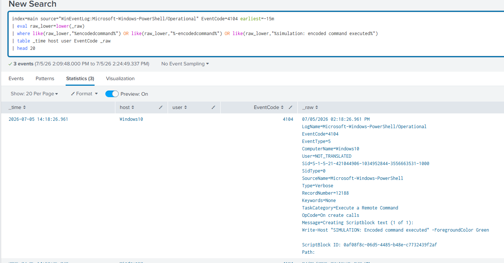
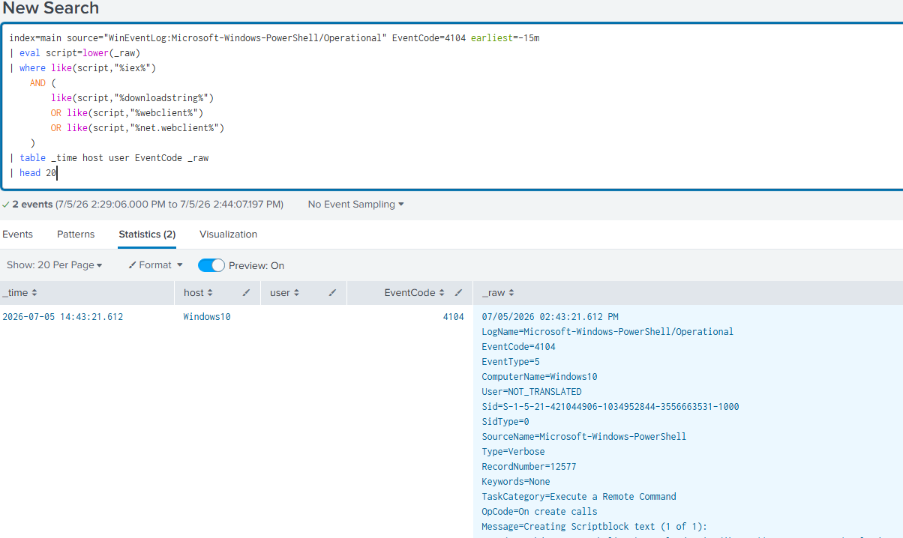
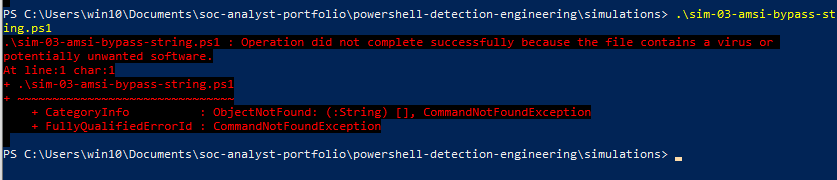
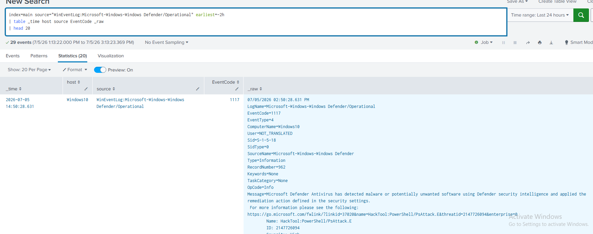
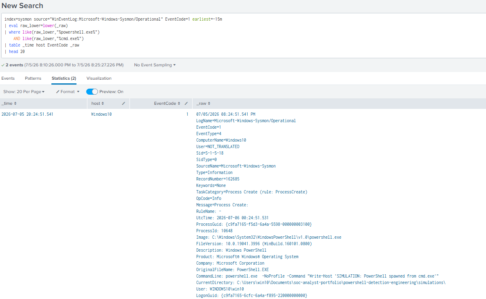
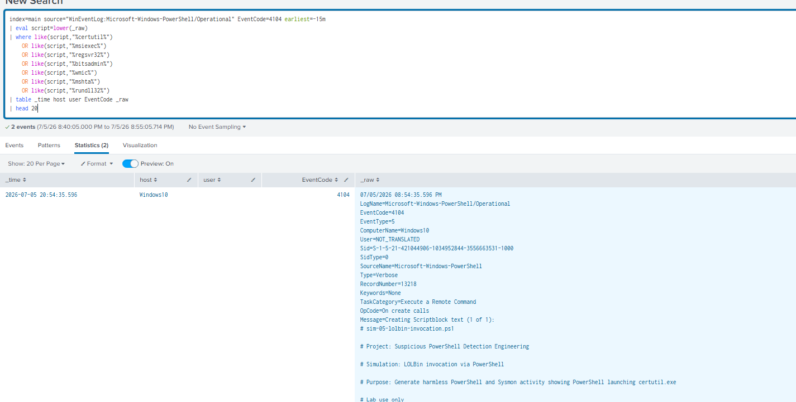
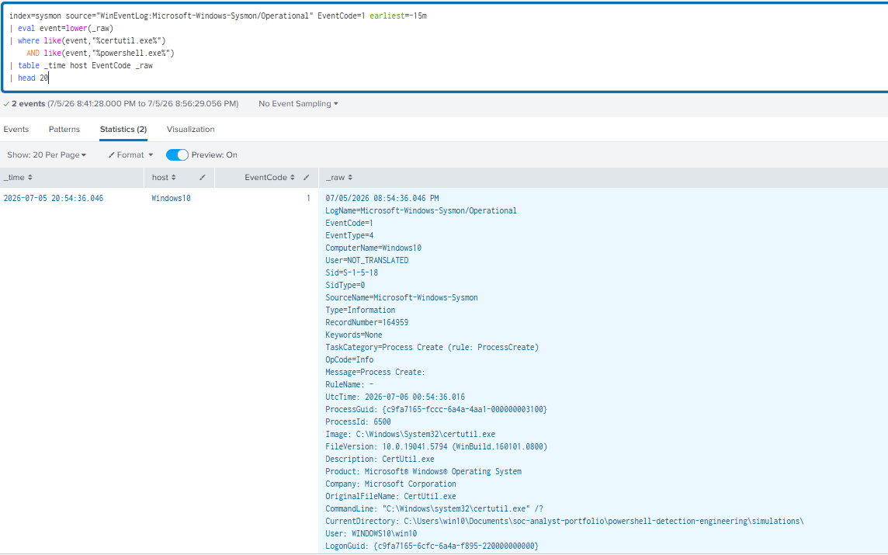

# Suspicious PowerShell Detection Engineering

## Overview

This project is a detection engineering lab focused on identifying suspicious PowerShell activity commonly seen in real-world attacks.

The lab uses Windows PowerShell logging, Sysmon, Windows Defender logs, and Splunk to detect suspicious PowerShell behavior. The project includes safe simulations, Splunk SPL detection rules, screenshots, analyst notes, and incident response documentation.

All simulations were performed in a controlled Windows 10 lab VM. No malware, exploitation, credential theft, or harmful payloads were used.

## Project Goals

The goal of this project was to demonstrate how a SOC analyst can:

- Enable PowerShell security logging
- Collect PowerShell Operational logs in Splunk
- Detect suspicious PowerShell execution patterns
- Use Sysmon process creation logs for parent-child process analysis
- Identify Windows Defender prevention events
- Write Splunk SPL detection rules
- Map detections to MITRE ATT&CK
- Document alert evidence and investigation steps

## Lab Environment

| Component | Details |
|---|---|
| Operating System | Windows 10 Lab VM |
| SIEM | Splunk Enterprise |
| Endpoint Logging | Sysmon |
| PowerShell Logging | Script Block Logging, Module Logging, Transcription Logging |
| Defender Logs | Microsoft-Windows-Windows Defender/Operational |
| Main PowerShell Log Source | Microsoft-Windows-PowerShell/Operational |
| Sysmon Log Source | Microsoft-Windows-Sysmon/Operational |
| Project Type | Detection Engineering and SOC Triage |

## Logging Sources Enabled

| Log Source | Event ID | Purpose |
|---|---:|---|
| PowerShell Script Block Logging | 4104 | Captures PowerShell script block content |
| PowerShell Module Logging | 4103 | Captures module and pipeline execution details |
| PowerShell Transcription Logging | Text File | Captures PowerShell session input and output |
| Sysmon Process Create | 1 | Captures process creation and parent-child relationships |
| Windows Defender Operational | 1116, 1117 | Captures malware or potentially unwanted software detection and remediation |

## Detections Built

| Alert ID | Detection Name | Log Source | MITRE ATT&CK | Severity |
|---|---|---|---|---|
| PS-001 | Encoded PowerShell Command Execution | PowerShell Event ID 4104 | T1059.001 | High |
| PS-002 | Download Cradle / Fileless Execution | PowerShell Event ID 4104 | T1059.001, T1105 | Critical |
| PS-003 | AMSI Bypass Attempt or Defender Block | PowerShell Event ID 4104, Windows Defender Operational | T1562.001 | Critical |
| PS-004 | Suspicious Parent Process Spawning PowerShell | Sysmon Event ID 1 | T1059.001 | Critical |
| PS-005 | LOLBin Invocation via PowerShell | PowerShell Event ID 4104, Sysmon Event ID 1 | T1218, T1059.001 | High |

## Attack Techniques Simulated Safely

### PS-001: Encoded PowerShell Command Execution

This simulation generated a harmless encoded PowerShell command using the `-EncodedCommand` flag.

The goal was to detect encoded command usage and suspicious PowerShell execution flags such as:

- `-EncodedCommand`
- `-NoProfile`
- `-NonInteractive`
- `-WindowStyle Hidden`

Evidence:



### PS-002: Download Cradle / Fileless Execution

This simulation generated a safe local download cradle pattern using:

- `IEX`
- `DownloadString`
- `Net.WebClient`
- `127.0.0.1`

No malicious payload was downloaded. The test used localhost only.

Evidence:



### PS-003: AMSI Bypass Attempt or Defender Block

The AMSI simulation was blocked by Windows Defender before execution. This was documented as a successful prevention event.

Windows Defender logged the activity as:

- Event ID 1116
- Event ID 1117
- Threat name observed: `HackTool:PowerShell/PsAttack.E`

This detection covers both PowerShell AMSI-related strings and Windows Defender block events.

Evidence:





### PS-004: Suspicious Parent Process Spawning PowerShell

This simulation generated a parent-child process relationship where `cmd.exe` launched `powershell.exe`.

This pattern is important because attackers may use Office applications, script hosts, browsers, or command shells to launch PowerShell.

Evidence:



### PS-005: LOLBin Invocation via PowerShell

This simulation generated safe PowerShell activity where PowerShell invoked `certutil.exe`.

No file download or payload execution was performed. The simulation only used a harmless help command.

Evidence:





## Detection Files

| File | Purpose |
|---|---|
| detections/PS-001-encoded-command.spl | Detects encoded PowerShell command execution |
| detections/PS-002-download-cradle.spl | Detects IEX and download cradle patterns |
| detections/PS-003-amsi-bypass.spl | Detects AMSI bypass indicators or Defender block events |
| detections/PS-004-parent-process.spl | Detects suspicious parent processes spawning PowerShell |
| detections/PS-005-lolbin-invocation.spl | Detects LOLBin invocation through PowerShell |

## Simulation Files

| File | Purpose |
|---|---|
| simulations/sim-01-encoded-command.ps1 | Generates safe encoded command activity |
| simulations/sim-02-download-cradle.ps1 | Generates safe IEX and DownloadString activity using localhost |
| simulations/sim-03-amsi-bypass-string-notes.md | Documents Defender blocking AMSI-related simulation |
| simulations/sim-04-parent-process.ps1 | Generates cmd.exe to powershell.exe parent-child activity |
| simulations/sim-05-lolbin-invocation.ps1 | Generates safe PowerShell to certutil.exe activity |

## Setup File

| File | Purpose |
|---|---|
| setup/enable-ps-logging.ps1 | Enables Script Block Logging, Module Logging, and Transcription Logging |

## Key Screenshots

| Screenshot | Description |
|---|---|
| ps-logging-enabled-script-output.png | PowerShell logging setup script output |
| event-4104-script-block-logging-test.png | Event Viewer confirmation of PowerShell Event ID 4104 |
| event-4103-module-logging-test.png | Event Viewer confirmation of PowerShell Event ID 4103 |
| powershell-transcript-files-created.png | PowerShell transcription logs created |
| splunk-powershell-operational-source-confirmed.png | Splunk PowerShell Operational source confirmed |
| splunk-event-4104-confirmed.png | Splunk Event ID 4104 confirmed |
| splunk-event-4103-confirmed.png | Splunk Event ID 4103 confirmed |
| splunk-4104-test-command-confirmed.png | Splunk test command confirmed in PowerShell 4104 logs |
| windows-defender-blocked-amsi-simulation.png | PowerShell AMSI-related simulation blocked by Windows Defender |
| event-viewer-defender-blocked-amsi-simulation.png | Event Viewer Defender evidence for AMSI-related block |
| splunk-defender-blocked-amsi-simulation.png | Splunk Defender event showing blocked AMSI-related simulation |
| splunk-ps001-encoded-command-detection.png | PS-001 encoded command detection result |
| splunk-ps002-download-cradle-detection.png | PS-002 download cradle detection result |
| splunk-ps004-parent-process-detection.png | PS-004 parent process detection result |
| splunk-ps005-lolbin-powershell-4104.png | PS-005 PowerShell 4104 LOLBin result |
| splunk-ps005-lolbin-invocation-detection.png | PS-005 Sysmon process creation result |

## MITRE ATT&CK Mapping

| Detection | Technique | Technique ID |
|---|---|---|
| Encoded PowerShell Command Execution | Command and Scripting Interpreter: PowerShell | T1059.001 |
| Download Cradle / Fileless Execution | Command and Scripting Interpreter: PowerShell | T1059.001 |
| Download Cradle / Fileless Execution | Ingress Tool Transfer | T1105 |
| AMSI Bypass Attempt or Defender Block | Impair Defenses: Disable or Modify Tools | T1562.001 |
| Suspicious Parent Process Spawning PowerShell | Command and Scripting Interpreter: PowerShell | T1059.001 |
| LOLBin Invocation via PowerShell | System Binary Proxy Execution | T1218 |
| LOLBin Invocation via PowerShell | Command and Scripting Interpreter: PowerShell | T1059.001 |

## Skills Demonstrated

- Detection engineering
- PowerShell log analysis
- Splunk SPL writing
- Sysmon process creation analysis
- Script Block Logging analysis
- Windows Defender event review
- MITRE ATT&CK mapping
- SOC alert triage
- Incident response documentation
- Safe attack simulation
- Technical reporting

## Safety Notes

This project was completed in a controlled Windows 10 lab VM.

The project does not include:

- Malware
- Credential theft
- Real payload downloads
- Exploitation
- AMSI bypass execution
- Defender disabling
- Public IP scanning
- Harmful scripts

All simulations were harmless and designed only to generate defensive log evidence.

## Repository Structure

```text
powershell-detection-engineering/
├── README.md
├── setup/
│   └── enable-ps-logging.ps1
├── simulations/
│   ├── sim-01-encoded-command.ps1
│   ├── sim-02-download-cradle.ps1
│   ├── sim-03-amsi-bypass-string-notes.md
│   ├── sim-04-parent-process.ps1
│   └── sim-05-lolbin-invocation.ps1
├── detections/
│   ├── PS-001-encoded-command.spl
│   ├── PS-002-download-cradle.spl
│   ├── PS-003-amsi-bypass.spl
│   ├── PS-004-parent-process.spl
│   └── PS-005-lolbin-invocation.spl
├── sigma/
│   └── README.md
├── playbooks/
│   └── powershell-detection-playbook.md
├── reports/
│   └── PS-SIM-2026-001.md
└── screenshots/
```

## Conclusion

This project demonstrates a practical SOC detection engineering workflow for suspicious PowerShell activity.

The lab shows how PowerShell logs, Sysmon logs, Windows Defender logs, and Splunk SPL can be used together to detect encoded commands, download cradle behavior, AMSI-related defense events, suspicious parent-child process activity, and LOLBin invocation.