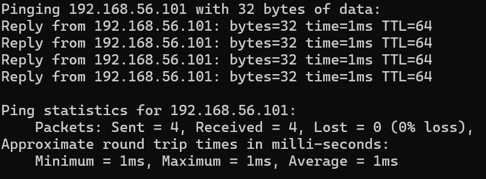
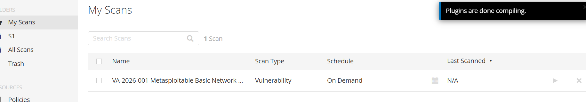
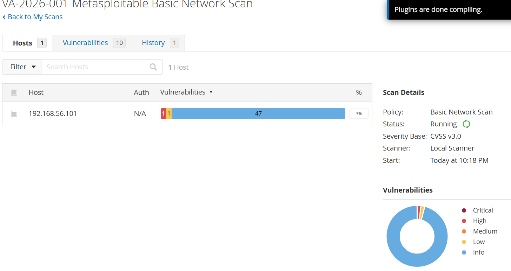
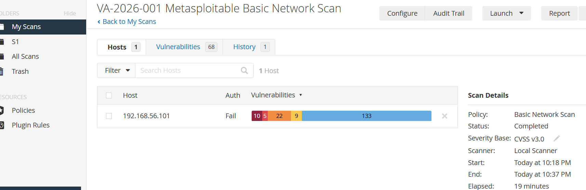
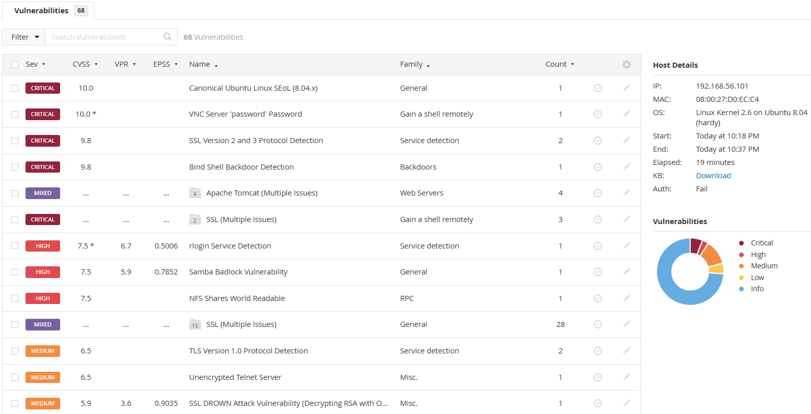
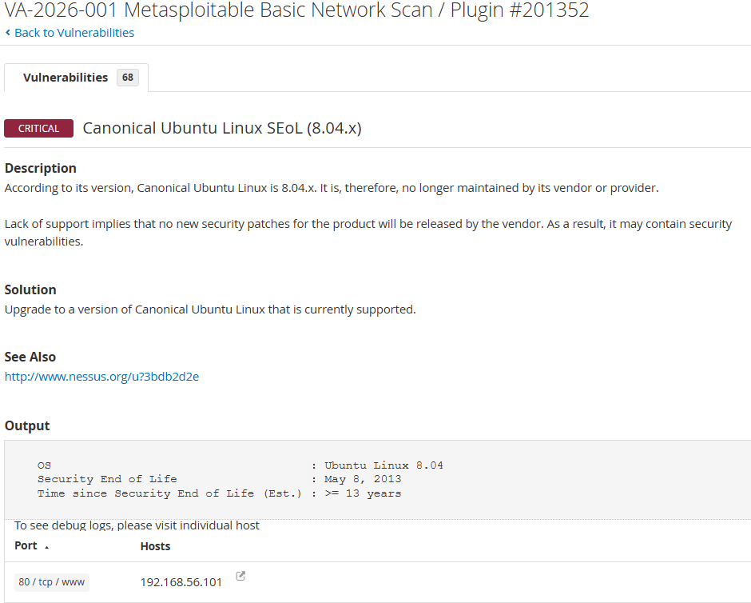
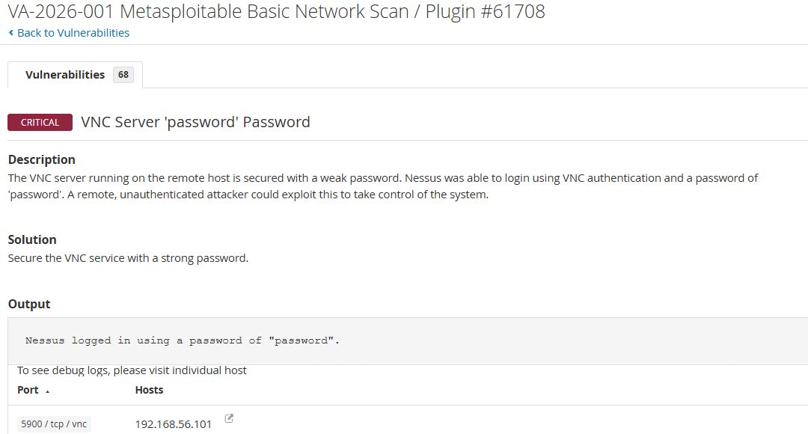
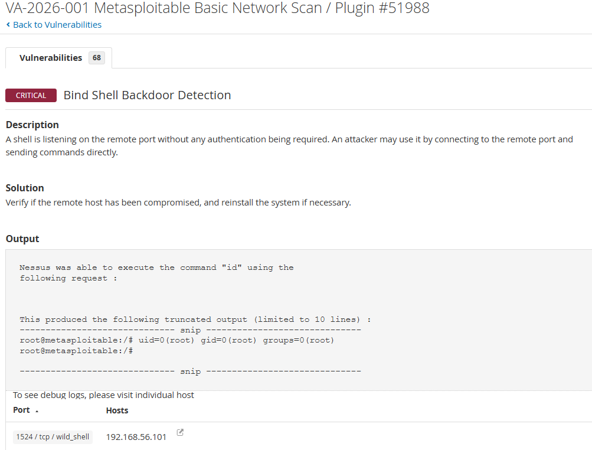
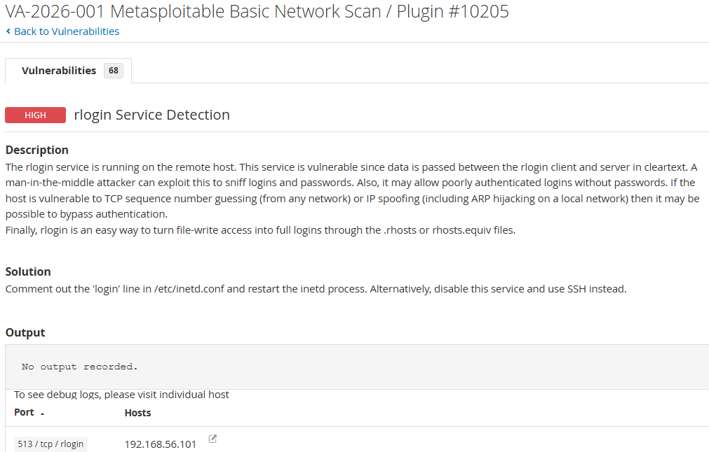
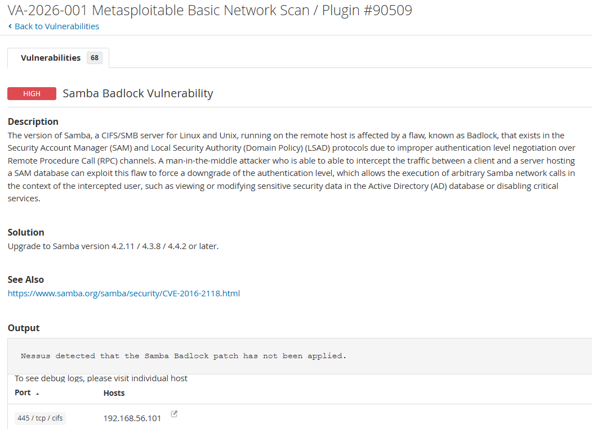

# VA-2026-001: Vulnerability Assessment and Remediation Report

## Assessment Information

| Item              | Details                                         |
| ----------------- | ----------------------------------------------- |
| Report ID         | VA-2026-001                                     |
| Project           | Vulnerability Assessment and Remediation Report |
| Target            | Metasploitable 2                                |
| Target IP Address | 192.168.56.101                                  |
| Scanner           | Nessus Essentials                               |
| Scan Policy       | Basic Network Scan                              |
| Scan Type         | Unauthenticated                                 |
| Network Type      | VirtualBox Host-Only Adapter                    |
| Severity Base     | CVSS v3.0                                       |
| Scan Status       | Completed                                       |
| Scan Duration     | 19 minutes                                      |

## Executive Summary

A vulnerability assessment was conducted against a Metasploitable 2 lab system using Nessus Essentials.

Metasploitable 2 is an intentionally vulnerable Linux virtual machine used for cybersecurity training. The target was placed on an isolated VirtualBox Host-Only network to prevent exposure to the internet or the wider local network.

The assessment identified multiple Critical, High, Medium, Low, and Informational findings. The most serious issues included an unsupported operating system, weak VNC authentication, a bind shell backdoor, insecure remote access services, and vulnerable network services.

The results show a high-risk security posture and demonstrate the importance of vulnerability scanning, prioritization, remediation planning, and follow-up validation.

## Scope

### In Scope

| Target           | IP Address     | Description                                               |
| ---------------- | -------------- | --------------------------------------------------------- |
| Metasploitable 2 | 192.168.56.101 | Intentionally vulnerable Linux VM used as the scan target |

### Out of Scope

The following were not included in this assessment:

* Public IP addresses
* Third-party systems
* Production systems
* Manual exploitation
* Password attacks
* Denial-of-service testing
* Malware execution
* Credentialed scanning

## Lab Safety

The target system was configured with a Host-Only Adapter in VirtualBox.

This ensured that the scanner host could communicate with the vulnerable VM while preventing the vulnerable target from being exposed to the internet or the wider local network.

Connectivity was confirmed using ICMP ping from the scanner host to the target.

## Methodology

The assessment followed this process:

1. Deploy Metasploitable 2 in VirtualBox.
2. Configure the VM with a Host-Only Adapter only.
3. Confirm connectivity between the scanner host and the target.
4. Install and configure Nessus Essentials.
5. Create a Basic Network Scan targeting only `192.168.56.101`.
6. Launch the scan and monitor progress.
7. Review completed scan results.
8. Record severity counts and key findings.
9. Capture screenshots for selected Critical and High findings.
10. Prepare remediation recommendations and reporting documents.

## Scan Configuration

| Setting        | Value                                         |
| -------------- | --------------------------------------------- |
| Scan Name      | VA-2026-001 Metasploitable Basic Network Scan |
| Target         | 192.168.56.101                                |
| Policy         | Basic Network Scan                            |
| Scanner        | Local Scanner                                 |
| Authentication | Not used                                      |
| Severity Base  | CVSS v3.0                                     |
| Start Time     | 10:18 PM                                      |
| End Time       | 10:37 PM                                      |
| Elapsed Time   | 19 minutes                                    |

The scan showed `Auth: Fail` because no credentials were provided. This was expected because the scan was intentionally performed as an unauthenticated network scan.

## Scan Evidence

### Scan Created

### Scan Running

### Scan Completed Summary

### Vulnerability List

## Severity Summary

| Severity             | Count |
| -------------------- | ----: |
| Critical             |    10 |
| High                 |     5 |
| Medium               |    22 |
| Low                  |     9 |
| Informational        |   133 |
| Vulnerability Groups |    68 |

## Findings Summary

| ID     | Severity | CVSS | Finding                                | Affected Host  | Port     | Priority |
| ------ | -------- | ---: | -------------------------------------- | -------------- | -------- | -------- |
| VA-001 | Critical | 10.0 | Canonical Ubuntu Linux SEoL 8.04.x     | 192.168.56.101 | 80/tcp   | P1       |
| VA-002 | Critical | 10.0 | VNC Server 'password' Password         | 192.168.56.101 | 5900/tcp | P1       |
| VA-003 | Critical |  9.8 | SSL Version 2 and 3 Protocol Detection | 192.168.56.101 | Multiple | P1       |
| VA-004 | Critical |  9.8 | Bind Shell Backdoor Detection          | 192.168.56.101 | 1524/tcp | P1       |
| VA-005 | High     |  7.5 | rlogin Service Detection               | 192.168.56.101 | 513/tcp  | P2       |
| VA-006 | High     |  7.5 | Samba Badlock Vulnerability            | 192.168.56.101 | 445/tcp  | P2       |
| VA-007 | High     |  7.5 | NFS Shares World Readable              | 192.168.56.101 | NFS      | P2       |
| VA-008 | Medium   |  6.5 | TLS Version 1.0 Protocol Detection     | 192.168.56.101 | Multiple | P3       |
| VA-009 | Medium   |  6.5 | Unencrypted Telnet Server              | 192.168.56.101 | 23/tcp   | P3       |
| VA-010 | Medium   |  5.9 | SSL DROWN Attack Vulnerability         | 192.168.56.101 | Multiple | P3       |

## Risk Priority Framework

| Priority | Criteria                                           | Remediation Timeline          |
| -------- | -------------------------------------------------- | ----------------------------- |
| P1       | Critical severity or direct system compromise risk | Fix immediately               |
| P2       | High severity or exposed insecure service          | Fix within 7 days             |
| P3       | Medium severity weakness                           | Fix within 30 days            |
| P4       | Low severity or informational issue                | Fix during maintenance window |

## Detailed Findings

## VA-001: Canonical Ubuntu Linux SEoL 8.04.x

| Field         | Details                      |
| ------------- | ---------------------------- |
| Severity      | Critical                     |
| CVSS          | 10.0                         |
| Affected Host | 192.168.56.101               |
| Port          | 80/tcp                       |
| Priority      | P1                           |
| Category      | Unsupported operating system |

### Description

Nessus identified the target as running Ubuntu Linux 8.04.x. This operating system version is no longer maintained by the vendor.

Unsupported operating systems no longer receive security updates. This increases the likelihood that known vulnerabilities remain unpatched.

### Evidence

### Risk

In a real environment, an unsupported operating system creates a major risk because attackers can target known vulnerabilities for which no new vendor patches are being released.

### Remediation

Recommended actions:

1. Upgrade the system to a currently supported operating system.
2. Migrate required services to a supported platform.
3. Remove the unsupported host from the network if it is no longer required.
4. Re-scan after migration or upgrade.

### Verification

Run a follow-up vulnerability scan and confirm that the unsupported operating system finding no longer appears.

---

## VA-002: VNC Server 'password' Password

| Field         | Details             |
| ------------- | ------------------- |
| Severity      | Critical            |
| CVSS          | 10.0                |
| Affected Host | 192.168.56.101      |
| Port          | 5900/tcp            |
| Priority      | P1                  |
| Category      | Weak authentication |

### Description

Nessus detected that the VNC service was secured with a weak password. The scanner was able to authenticate using the password `password`.

### Evidence

### Risk

Weak remote access credentials may allow unauthorized users to gain access to the system. If exposed in a real environment, this could lead to unauthorized control of the host.

### Remediation

Recommended actions:

1. Disable VNC if it is not required.
2. If VNC is required, set a strong password.
3. Restrict VNC access to trusted IP addresses.
4. Place remote access behind VPN or secure access controls.
5. Re-scan to confirm weak authentication is no longer detected.

### Verification

Run a follow-up scan and confirm that the weak VNC password finding is resolved.

---

## VA-003: SSL Version 2 and 3 Protocol Detection

| Field         | Details                  |
| ------------- | ------------------------ |
| Severity      | Critical                 |
| CVSS          | 9.8                      |
| Affected Host | 192.168.56.101           |
| Port          | Multiple                 |
| Priority      | P1                       |
| Category      | Weak encryption protocol |

### Description

Nessus detected that SSL version 2 and SSL version 3 were enabled on the target.

SSLv2 and SSLv3 are outdated and insecure protocols. They are vulnerable to downgrade and cryptographic attacks.

### Risk

Use of insecure SSL protocols can weaken encrypted communication and expose systems to interception or downgrade attacks.

### Remediation

Recommended actions:

1. Disable SSLv2.
2. Disable SSLv3.
3. Enable TLS 1.2 or later.
4. Review affected services using SSL/TLS.
5. Re-scan to confirm the weak protocols are disabled.

### Verification

Run a follow-up Nessus scan and confirm SSLv2 and SSLv3 are no longer detected.

---

## VA-004: Bind Shell Backdoor Detection

| Field         | Details           |
| ------------- | ----------------- |
| Severity      | Critical          |
| CVSS          | 9.8               |
| Affected Host | 192.168.56.101    |
| Port          | 1524/tcp          |
| Priority      | P1                |
| Category      | Backdoor exposure |

### Description

Nessus detected a bind shell listening on the target system. The scan output showed that Nessus was able to execute the `id` command and receive root-level output.

This indicates a direct compromise risk.

### Evidence

### Risk

A bind shell can allow unauthorized command execution on the target system. In a real environment, this would require immediate containment and investigation.

### Remediation

Recommended actions:

1. Immediately isolate the affected host.
2. Investigate whether the system has been compromised.
3. Remove the backdoor service.
4. Rebuild or reinstall the system if compromise is confirmed.
5. Review logs for unauthorized access.
6. Re-scan after remediation.

### Verification

Run a follow-up Nessus scan and confirm the bind shell finding no longer appears.

---

## VA-005: rlogin Service Detection

| Field         | Details                |
| ------------- | ---------------------- |
| Severity      | High                   |
| CVSS          | 7.5                    |
| Affected Host | 192.168.56.101         |
| Port          | 513/tcp                |
| Priority      | P2                     |
| Category      | Insecure remote access |

### Description

Nessus detected the rlogin service running on the target host. rlogin passes data in cleartext and is considered insecure.

### Evidence

### Risk

Cleartext remote access services may expose credentials and session data to attackers with network visibility.

### Remediation

Recommended actions:

1. Disable rlogin.
2. Remove or comment out rlogin configuration entries.
3. Restart the relevant service.
4. Use SSH instead of rlogin.
5. Restrict remote access to trusted users and hosts.

### Verification

Run a follow-up scan and confirm that rlogin is no longer detected.

---

## VA-006: Samba Badlock Vulnerability

| Field         | Details           |
| ------------- | ----------------- |
| Severity      | High              |
| CVSS          | 7.5               |
| Affected Host | 192.168.56.101    |
| Port          | 445/tcp           |
| Priority      | P2                |
| Category      | SMB vulnerability |

### Description

Nessus identified that the Samba service on the target is affected by the Badlock vulnerability.

Badlock relates to weaknesses in authentication handling and may allow a man-in-the-middle attacker to downgrade authentication protections.

### Evidence

### Risk

A vulnerable SMB service may expose the environment to authentication downgrade risk, network compromise, and unauthorized access to shared resources.

### Remediation

Recommended actions:

1. Upgrade Samba to a patched version.
2. Review SMB configuration.
3. Disable unnecessary SMB shares.
4. Restrict SMB access to trusted hosts only.
5. Re-scan to verify that the finding is resolved.

### Verification

Run a follow-up Nessus scan and confirm that Samba Badlock is no longer detected.

---

## VA-007: NFS Shares World Readable

| Field         | Details               |
| ------------- | --------------------- |
| Severity      | High                  |
| CVSS          | 7.5                   |
| Affected Host | 192.168.56.101        |
| Port          | NFS                   |
| Priority      | P2                    |
| Category      | Insecure file sharing |

### Description

Nessus identified world-readable NFS shares on the target host.

### Risk

World-readable file shares may allow unauthorized users or systems to access sensitive files.

### Remediation

Recommended actions:

1. Review NFS exports.
2. Remove world-readable permissions.
3. Restrict NFS access to trusted IP addresses.
4. Apply least privilege permissions.
5. Restart the NFS service.
6. Re-scan to verify exposure is removed.

### Verification

Run a follow-up scan and confirm that world-readable NFS shares are no longer detected.

---

## VA-008: TLS Version 1.0 Protocol Detection

| Field         | Details                  |
| ------------- | ------------------------ |
| Severity      | Medium                   |
| CVSS          | 6.5                      |
| Affected Host | 192.168.56.101           |
| Port          | Multiple                 |
| Priority      | P3                       |
| Category      | Weak encryption protocol |

### Description

Nessus detected that TLS 1.0 was enabled on the target.

### Risk

TLS 1.0 is outdated and should not be used for modern secure communication.

### Remediation

Recommended actions:

1. Disable TLS 1.0.
2. Enable TLS 1.2 or later.
3. Review affected services for compatibility issues.
4. Re-scan to confirm TLS 1.0 is disabled.

### Verification

Run a follow-up scan and confirm that TLS 1.0 is no longer detected.

---

## VA-009: Unencrypted Telnet Server

| Field         | Details                 |
| ------------- | ----------------------- |
| Severity      | Medium                  |
| CVSS          | 6.5                     |
| Affected Host | 192.168.56.101          |
| Port          | 23/tcp                  |
| Priority      | P3                      |
| Category      | Cleartext remote access |

### Description

Nessus detected an unencrypted Telnet server running on the target.

### Risk

Telnet sends traffic in cleartext. This can expose usernames, passwords, and session data.

### Remediation

Recommended actions:

1. Disable Telnet.
2. Use SSH for remote administration.
3. Restrict remote access to trusted users and systems.
4. Re-scan to confirm Telnet is no longer detected.

### Verification

Run a follow-up scan and confirm that the Telnet service is no longer exposed.

---

## VA-010: SSL DROWN Attack Vulnerability

| Field         | Details           |
| ------------- | ----------------- |
| Severity      | Medium            |
| CVSS          | 5.9               |
| Affected Host | 192.168.56.101    |
| Port          | Multiple          |
| Priority      | P3                |
| Category      | SSL vulnerability |

### Description

Nessus identified an SSL DROWN-related vulnerability on the target.

### Risk

DROWN is associated with insecure SSL configurations and SSLv2 support. Systems affected by DROWN may expose encrypted communication to cryptographic attack.

### Remediation

Recommended actions:

1. Disable SSLv2.
2. Update affected SSL services.
3. Replace weak or outdated certificates where necessary.
4. Re-scan to confirm the issue is resolved.

### Verification

Run a follow-up scan and confirm that the DROWN finding is resolved.

---

## Remediation Order

| Order | Action                                                    |
| ----- | --------------------------------------------------------- |
| 1     | Isolate or rebuild system affected by bind shell backdoor |
| 2     | Upgrade unsupported Ubuntu 8.04.x system                  |
| 3     | Disable or secure weak VNC access                         |
| 4     | Disable SSLv2 and SSLv3                                   |
| 5     | Disable rlogin and Telnet                                 |
| 6     | Patch Samba                                               |
| 7     | Restrict NFS shares                                       |
| 8     | Disable TLS 1.0                                           |
| 9     | Re-scan and verify remediation                            |

## Analyst Notes

This assessment was performed in a lab environment using an intentionally vulnerable virtual machine.

Because Metasploitable 2 is designed to contain vulnerabilities, the objective was not to fully harden the system. The objective was to demonstrate vulnerability discovery, prioritization, documentation, and remediation planning.

Raw Nessus export files were not uploaded. Findings were documented manually from the Nessus web interface and supported with screenshots.

## Conclusion

The vulnerability assessment successfully identified multiple Critical and High findings on the Metasploitable 2 lab target.

The most severe risks included an unsupported operating system, weak VNC authentication, exposed insecure remote access services, vulnerable Samba services, and a bind shell backdoor.

This project demonstrates a practical vulnerability management workflow, including scanning, severity review, prioritization, evidence collection, remediation planning, and analyst-style reporting.
